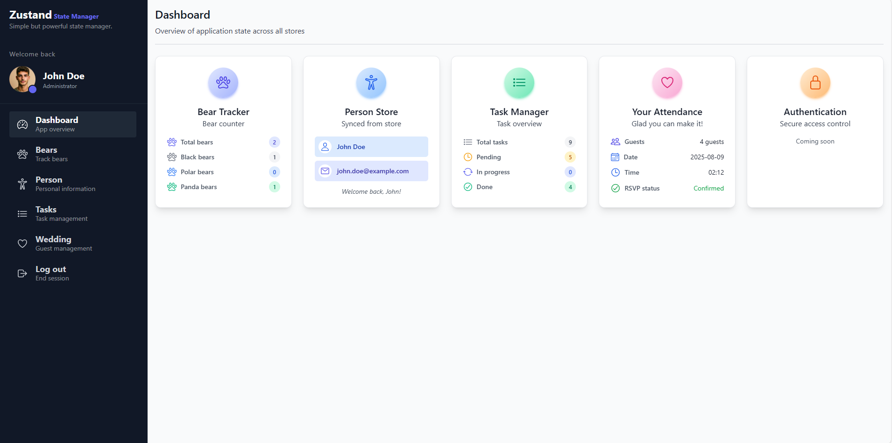

# 🐻 Zustand Learning Guide

A modern and interactive learning project focused on mastering global state management in React using **Zustand**. This guide covers practical usage patterns, modular architecture, and UI integration with Tailwind CSS, React Router DOM, and TypeScript.

## Table of Contents

- [Requirements](#requirements)
- [Technology Stack](#technology-stack)
- [Project Structure](#project-structure)
- [Installation](#installation)
- [Usage](#usage)
- [Contributing](#contributing)
- [License](#license)
- [Author](#author)

## Requirements

You need to have the following installed:

A source code editor such as [VSCode](https://code.visualstudio.com/), [Sublime Text](https://www.sublimetext.com/), or any other editor of your choice.

[](https://nodejs.org/en)
[](https://www.npmjs.com/)

> [!NOTE]  
> Clicking on the Node.js badge will take you to the Node.js website, where you can download the installer. It is recommended to use the stable version. When you install Node.js, npm will be installed automatically.

Check your Node.js and npm installation by running:

```bash
node --version
npm --version
```

## Technology Stack

The project utilizes the following technologies:

<div>
  
  
  
  
  
</div>

- ⚛️ [React Router DOM](https://reactrouter.com/) — for client-side routing
- 🐻 [Zustand](https://zustand-demo.pmnd.rs/) — for global state management

## Project Structure

The project is structured as follows:

```bash
├───📁 public/
├───📁 src/
│   ├───📁 assets/
│   ├───📁 components/
│   │   ├───📁 bears/
│   │   ├───📁 errors/
│   │   ├───📁 jira/
│   │   ├───📁 person/
│   │   ├───📁 shared/
│   │   │   ├───📁 cards/
│   │   │   ├───📁 sidemenu/
│   │   │   └───📁 stats/
│   │   ├───📁 wedding/
│   │   └───📄 index.ts
│   ├───📁 data/
│   │   ├───📁 mocks/
│   │   └───📄 index.ts
│   ├───📁 hooks/
│   │   ├───📄 index.ts
│   ├───📁 interfaces/
│   │   ├───📄 index.ts
│   ├───📁 layouts/
│   │   └───📄 index.ts
│   ├───📁 pages/
│   │   ├───📁 auth/
│   │   ├───📁 basic/
│   │   ├───📁 dashboard/
│   │   ├───📁 objects/
│   │   ├───📁 slices/
│   │   └───📄 index.ts
│   ├───📁 router/
│   ├───📁 stores/
│   │   ├───📁 auth/
│   │   ├───📁 bears/
│   │   ├───📁 middlewares/
│   │   ├───📁 person/
│   │   ├───📁 storage/
│   │   ├───📁 tasks/
│   │   ├───📁 wedding/
│   │   └───📄 index.ts
│   ├───📁 utils/
│   ├───📄 index.css
│   ├───📄 main.tsx
│   ├───📄 Root.tsx
│   └───📄 vite-env.d.ts
├───📄 .env.template
├───📄 .eslintrc.cjs
├───📄 index.html
├───📄 LICENSE
├───📄 package-lock.json
├───📄 package.json
├───📄 postcss.config.js
├───📄 README.md
├───📄 tailwind.config.js
├───📄 tsconfig.json
├───📄 tsconfig.node.json
└───📄 vite.config.ts
```

## Installation

To set up the project locally, follow these steps:

1. **Clone the repository:**

```bash
git clone https://github.com/daniel-pompa/zustand-learning-guide.git
```

2. **Navigate to the project directory:**

```bash
cd zustand-learning-guide
```

3. **Install dependencies:**

```bash
npm install
```

4. **Run the development server:**

```bash
npm run dev
```

> [!NOTE]
> The server will typically run on <http://localhost:5173>, but check the output on your terminal to be sure.

## Usage

Once the server is running, you can access the project at <http://localhost:5173>.

Here is a screenshot of the Dashboard page to give you an idea of the interface:



This project is organized into different sections accessible through the side menu. Each section demonstrates an example of global state management using Zustand.

### Navigation

Use the side menu to easily navigate between the different sections and explore the various examples of global state management with Zustand. Each section showcases specific patterns and use cases to help you understand how to structure and manage state effectively.

## Contributing

Contributions are welcome! Please follow these steps:

1. Fork the repository.
2. Create a new branch (`git checkout -b feature-branch`).
3. Make your changes.
4. Commit your changes (`git commit -am 'add new feature'`).
5. Push to the branch (`git push origin feature-branch`).
6. Create a new Pull Request.

Before submitting a Pull Request, ensure that your code follows the project's coding style and conventions.

## License

This project is licensed under the MIT License.

[](https://choosealicense.com/licenses/mit/)

> [!NOTE]
> Clicking on the MIT License badge for see the LICENSE file for details.

## Author

This project is maintained and developed by **Daniel Pompa Pareja**.

For any questions or suggestions, feel free to reach out via [email](mailto:daniel.40.pompa@gmail.com).

Enjoy learning and experimenting with Zustand!

[⬆️ Back to Top](#table-of-contents)
